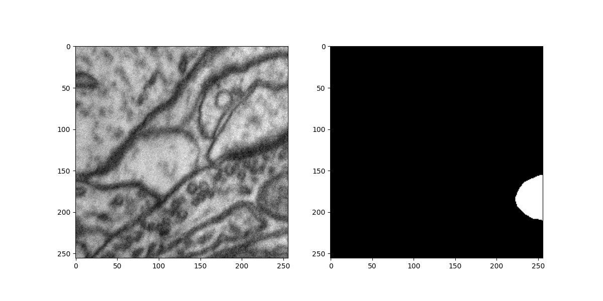
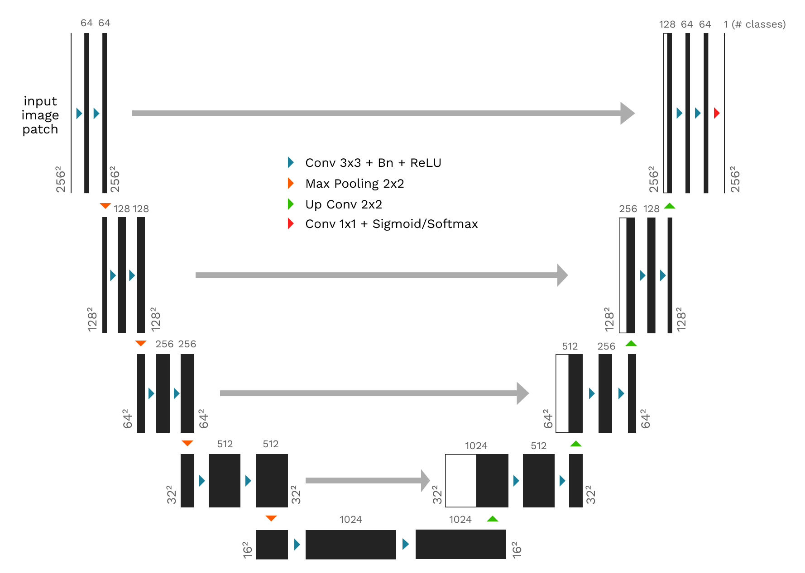

<center>
    
# Biomedical Image Segmentation

</center>

Pixel-level classification using a U-Net architecture for Biomedical Image Segmentation of Mitochondria

### The Dataset
For the `create_patches.py` script to run as expected, make sure you download the sub-volumes (including groundtruth sub-volumes) for both training and testing as our dataset.

You can download the dataset from [EPFL](https://www.epfl.ch/labs/cvlab/data/data-em/)

## 🚀 Set up the environment locally
1. Clone the repository
```shell
git clone https://github.com/KushGabani/Biomedical-Image-Segmentation.git
```
2. Navigate to the directory
```shell
cd Biomedical-Image-Segmentation
```
3. Create virtual environment using virtualenv
```shell
# Not required if already installed
pip install virtualenv  # (For Windows/Linux)
pip3 install virtualenv # (For Mac)

# Required
virtualenv venv
```
3. Activate the virtual environment
```shell
source venv/bin/activate # (For Mac/Linux)
venv\Scripts\activate # (For Windows)
```
4. Download the required dependencies
```shell
pip install -r requirements.txt
```
#### You have successfully setup the environment locally. ✨


## 🥓 Enlarge the dataset by splitting into small patches
A single image of the dataset is 768 x 1024, hence we will split each images and their respective masks in small patches that will be easier to process and also increase the number of images to train on.

> 🚨 Make sure you create a new directory named `data` in the root of the project first before executing the script

Execute this command to run the `create_patches.py` script.
```shell
(For Windows)
python ./create_patches.py <dataset_root_directory> <patch_size>

(For Mac/Linux)
python3 ./create_patches.py <dataset_root_directory> <patch_size>
```
A patch size of 256 x 256 is used if not specified.

## 🎡 Preprocessing the data
Preprocessed data is too large to be uploaded to the github repository, hence you will have to preprocess locally

Once the dataset is downloaded and the patches are created, you can now execute the `data_preprocessor.py` script to preprocess and save the data in a numpy compressed file format.
```shell
(For Windows)
python ./data_preprocessor.py
  
(For Mac/Linux)
python3 ./data_preprocessor.py
```
The `.npz` files can be found in the root directory of the project with the filename `preprocessed_data.npz`

## 🎋 Visualize Preprocessed Samples
You can now visualize the preprocessed data by executing the `plot_samples.py` script.
```shell
(For Windows)
python ./plot_samples.py

(For Mac/Linux)
python3 ./plot_samples.py
```



## 🎃 Model Architecture
The U-Net architecture is used for segmentation. The `unet.py` contains the model architecture implemented in Tensorflow 2.x using the Keras API
